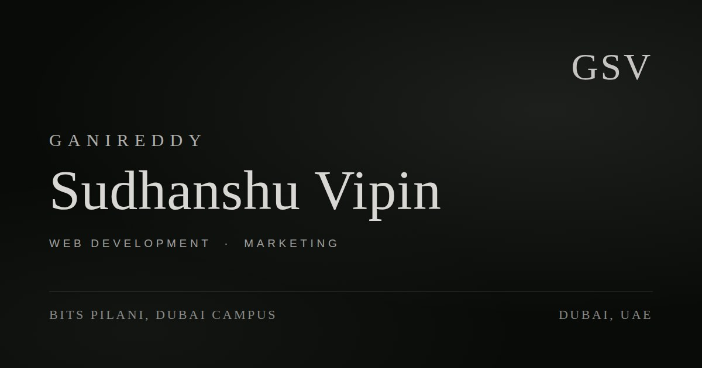

# Ganireddy Sudhanshu Vipin — Portfolio

**[→ vipinganireddy-portfolio.vercel.app](https://vipinganireddy-portfolio.vercel.app/)**

---

Computer Science undergraduate at BITS Pilani, Dubai Campus. Building websites end to end — web development and marketing.

**Experience**
- Marketing Intern — CURD Network, Dubai (Jun–Jul 2026)
- Web Developer Intern — Reliance Industries, Kakinada (Jun–Jul 2025)

**Projects**
- [Deep Ocean](https://deep-ocean-iota.vercel.app/) — interactive clownfish reef in vanilla JS + Canvas
- [IKYK Games](https://ikyk-games.vercel.app/) — 50 browser games in a single offline HTML file

**Stack** — Vanilla HTML, CSS, JavaScript. No frameworks, no build step, no dependencies.

---

[LinkedIn](https://linkedin.com/in/vipinganireddy) · [GitHub](https://github.com/vipinganireddy) · [vipinganireddy@gmail.com](mailto:vipinganireddy@gmail.com)
